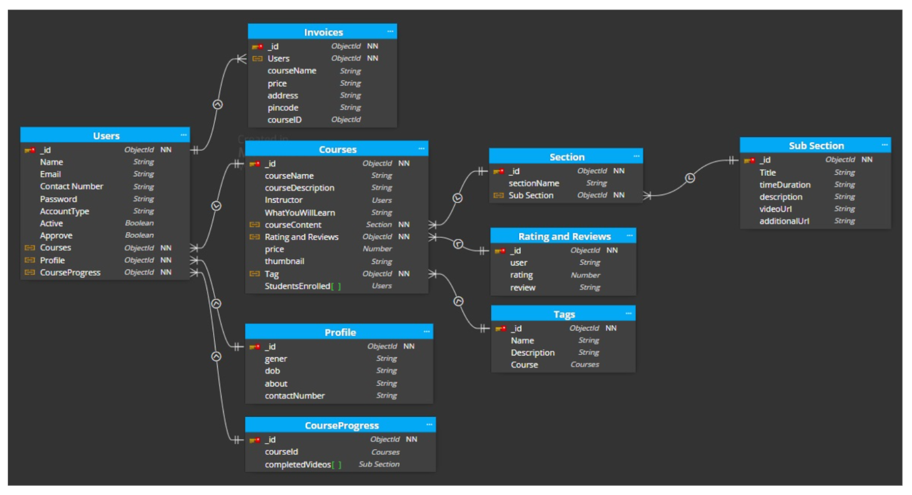
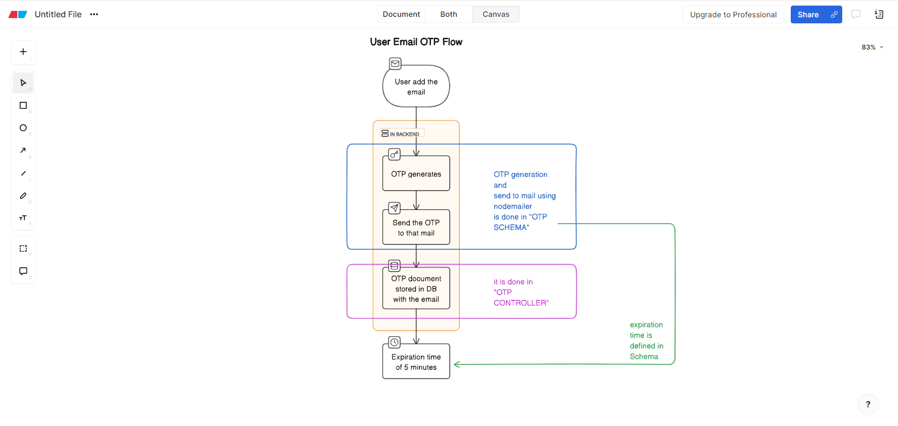
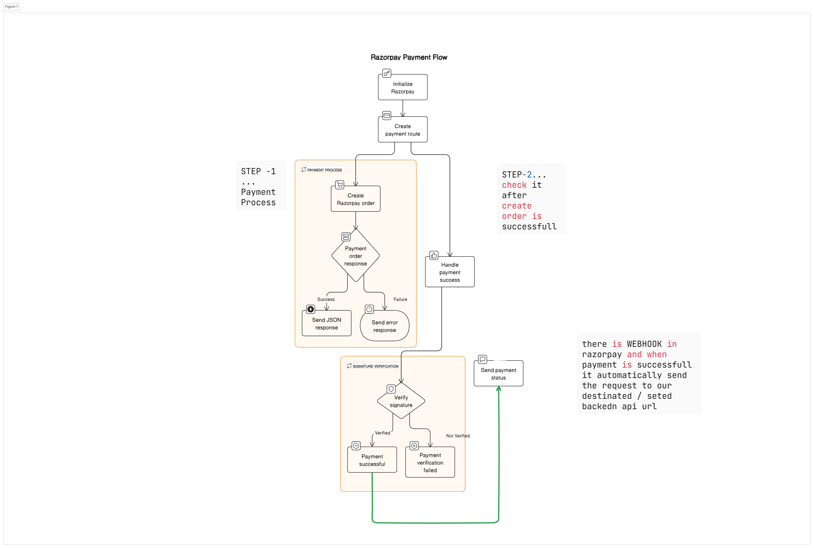
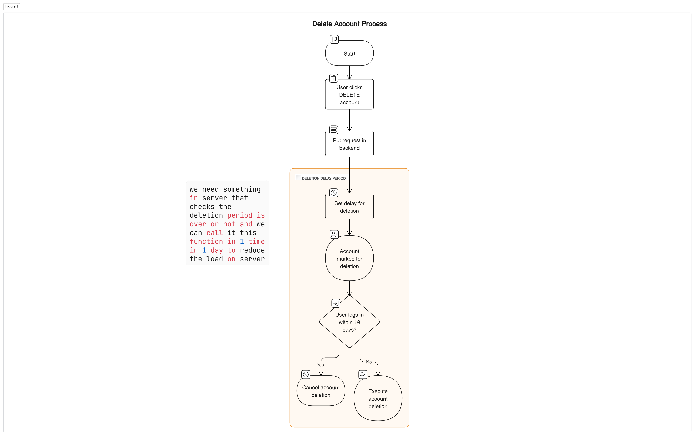

# StudySync

## Design UI/UX ( Figma )
UI build by Parth Madhvani with 🤍.
Check out the Figma design [here](https://www.figma.com/design/0Umsb2bJ0JxMGowIjoTYcZ/StudySync?node-id=0-1&t=CH4UX9yXAudOoDQW-1)

## Project Description

StudySync is a comprehensive ed-tech platform that fosters a dynamic learning environment by allowing users to create, consume, and rate educational content. This project is built using the MERN stack, combining ReactJS, NodeJS, MongoDB, and ExpressJS.

StudySync aims to:

- Provide students with a seamless and interactive learning experience, making education accessible and engaging.
- Offer instructors a platform to showcase their expertise and connect with learners worldwide.

## Tech Stack

- **Frontend**: ReactJS with Tailwind CSS
- **Backend**: NodeJS, ExpressJS
- **Database**: MongoDB
- **Deployment**: Vercel (Frontend), Render or Railway (Backend), MongoDB Atlas (Database)
- **Media Management**: Cloudinary
- **State Management**: Redux


## Features

StudySync offers the following key features:

### For Students:

- **Homepage**: A brief introduction to the platform with links to the course list and user details.
  
- **Course List**: Access to a list of all available courses, including descriptions and ratings.
  
- **Wishlist**: View and manage courses added to your wishlist.
  
- **Cart Checkout**: Complete course purchases securely.
  
- **Course Content**: Access course-specific content, including videos and related materials.
  
- **User Details**: Access and manage your account information, including name, email, and other relevant details.
  
- **User Edit Details**: Edit your account information as needed.

- **Course Enrollment**: Easily enroll in courses to access their content.

### For Instructors:

- **Dashboard**: Overview of instructor's courses, ratings, and feedback.
  
- **Insights**: Detailed insights into course metrics, including views, clicks, and more.
  
- **Course Management Pages**: Create, update, delete, and manage courses, content, and pricing.
  
- **View and Edit Profile Details**: Access and edit instructor account details.

### For Admin (future scope):

- **Dashboard**: Overview of platform courses, instructors, and students.
  
- **Insights**: Detailed platform metrics, including registered users, courses, and revenue.
  
- **Instructor Management**: Admin tools to manage instructors, their accounts, courses, and ratings.
  
- **Other Relevant Pages**: Additional admin functions like user and course management.


## How to Run

### Frontend

1. Navigate to the frontend directory.
   ```bash
   cd frontend
   ```

2. Install dependencies.
   ```bash
   npm install
   ```

3. Start the frontend server.
   ```bash
   npm run start
   ```

### Backend

#### DB schema design




#### How OTP is working ?


#### How payment gateway working in backend using RAZORPAY ?



```
const express = require('express');
const Razorpay = require('razorpay');

const app = express();

// Initialize Razorpay with your API key and secret key
const razorpay = new Razorpay({
  key_id: 'YOUR_KEY_ID', // Replace with your Razorpay API Key ID
  key_secret: 'YOUR_KEY_SECRET', // Replace with your Razorpay API Secret Key
});

// ===============================================
// PAYMENT INITIATE / CREATE
// Create a route to initiate the payment
app.post('/create-payment', async (req, res) => {
  const options = {
    amount: 50000, // amount in the smallest currency unit (e.g., paise for INR)
    currency: 'INR', // currency (INR here)
    receipt: 'receipt_order_1', // unique identifier for the transaction
    // payment_capture: 1, // Auto capture payment (1 - true, 0 - false)
    notes : {
        courseId : "courseId" ,
        userId : "userId"
    }                      // can add anyhthing that we can add in notes
  };

  try {
    // Create an order using Razorpay API
    const response = await razorpay.orders.create(options);
    res.json(response); // Send the created order details back to the client
  } catch (error) {
    res.status(500).json({ error: error.message }); // Handle any errors
  }
});
// =============================================
// SIGNATURE VERIFICATION
// Create a route to handle payment success
app.post('/payment-success', (req, res) => {
  const body = req.body;
  const signature = body.razorpay_signature;

  // Verify the payment signature received from Razorpay
  const verified = razorpay.verifySignature(body, signature);
  if (verified) {
    // Payment verification successful, proceed with your logic here
    res.json({ status: 'Payment successful' });
  } else {
    // Payment verification failed
    res.status(400).json({ error: 'Payment verification failed' });
  }
});

```

- once the payment is proceed successfully by the user, RazorPay will send a POST REQ through webhook to the WEBHOOK URL that you have set in the razorpay dashboard.Handle the verification of payment in the `/payment-success` route
- we have to add the "SIGNATURE VERIFICATION URL" in the webhook of the razorpay dashboard. 

### Problems that i faced
- Buttons are not available of LOGIN and SIGNUP. I forgot to set the value of user loggedin profile in locat storage.How I solved it? - i got 2 ways here 1= that i used in my first notes appliaction if there is token available in cookies firstly then put the request on backend and grab the details of user. 2= set the local storage values while login is successfull and i choose the second way because i want to learn something new about local storage.

- MATCHROUTE function fata gaya and error was Calling the original function again and again recursive function without and condition so it is doing infinite looping. How i solved it ? - i just change the function name and everything is working fine.

```
  const matchRoute = (route) => {
    // matchPath is predefined function in react router dom
    // it gives TRUE value if the route is matching otherwise it will give FALSE value
    return matchPath({ path: route }, location.pathname)
  }

```

- Learn about Delete account feature like if person clicked on DELETE account then it will put request in backend but it will not be successfully excecuted instat. We can set time like it will excecuted after 10 days or something and add extra feature that during 10 days if user loggedin with same account then the deletion of account process removed automatically.



- working with edit/create course with creating section and sub section is difficult for me.It takes hours of time. After hit and trial, one modal is successfully working.

- onclick ==> e.stopPropogation() while one div has onclick and that child div also has onclick so when we clicking on the main div that time child div's onclick is also working so that ttime using e.stopPropogation() for child div to avoid this and giving the partiular div onclick working.

- swiper js ==> headache for me in import of swiper js components 

- videoDetails with previous,next video is challaenging 


- Made with ♥️ Parth Madhvani © 2024 StudySync